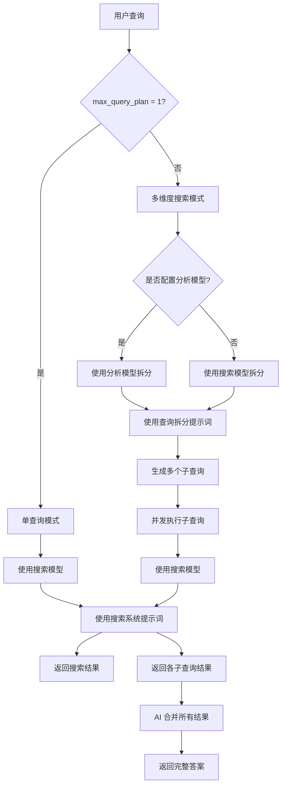

# AI Search MCP Server

[](https://github.com/lianwusuoai/ai-search-mcp/blob/main/LICENSE)

通用 AI 搜索 MCP 服务器，支持任何兼容 OpenAI API 格式的 AI 模型进行联网搜索。

**高性能 Rust 实现，支持真正的并发搜索。**

## 特性

- ✅ 支持任何 OpenAI API 兼容的模型
- ✅ 支持流式和非流式响应
- ✅ 自动过滤 AI 思考内容
- ✅ **自动时间注入**：每次搜索自动注入当前时间
- ✅ **多维度搜索**：自动拆分复杂查询为多个子问题并行搜索
- ✅ **智能重试机制**：自动重试失败的请求
- ✅ **高性能并发**：基于 Tokio 异步运行时
- ✅ **零依赖部署**：单一二进制文件
- ✅ 完全可配置（支持自定义系统提示词）

## 快速开始

### 1. 安装

**一键安装（推荐）**：

```bash
# Windows (PowerShell)
irm https://raw.githubusercontent.com/lianwusuoai/ai-search-mcp/main/scripts/install.ps1 | iex

# Linux/macOS
curl -fsSL https://raw.githubusercontent.com/lianwusuoai/ai-search-mcp/main/scripts/install.sh | bash
```

**手动安装**：

```bash
# 使用 pip
pip install ai-search-mcp

# 或使用 uvx（推荐）
uvx ai-search-mcp
```

### 2. 配置

**Web UI 配置（推荐）**：

```bash
# 启动配置界面
ai-search-mcp --http --port 11000

# 浏览器打开
http://localhost:11000/config
```

**配置文件**（`~/.ai-search-mcp/config.json`）：

```json
{
  "api_url": "http://localhost:10000",
  "api_key": "your-api-key",
  "search_model_id": "Grok",
  "analysis_model_id": "MiniMax",
  "timeout": 180,
  "stream": true,
  "filter_thinking": true,
  "analysis_retry_count": 1,
  "search_retry_count": 0,
  "log_level": "INFO",
  "max_query_plan": 10
}
```

### 3. 集成到 MCP 客户端

#### 方式 1：stdio 模式（推荐，本地使用）

编辑配置文件（Kiro: `.kiro/settings/mcp.json` | Claude Desktop: `claude_desktop_config.json`）：

```json
{
  "mcpServers": {
    "ai-search": {
      "command": "uvx",
      "args": ["ai-search-mcp"]
    }
  }
}
```

**特点**：
- 自动启动进程，无需手动管理
- 通过标准输入/输出通信
- 客户端关闭时自动退出
- 适合：IDE 集成（Kiro、Claude Desktop、Cursor）

#### 方式 2：HTTP 模式（启动独立服务器）

```json
{
  "mcpServers": {
    "ai-search": {
      "command": "ai-search-mcp",
      "args": ["--http", "--port", "11000"]
    }
  }
}
```

**特点**：
- 启动独立 HTTP 服务器进程
- 支持多客户端并发连接
- 需要手动管理进程生命周期
- 适合：临时测试、开发调试

#### 方式 3：SSE 模式（连接远程服务器）

**前提**：需要先启动 HTTP 服务器（Docker 或手动启动）

```bash
# Docker 启动（推荐）
docker-compose up -d

# 或手动启动
ai-search-mcp --http --port 11000
```

**配置**：

```json
{
  "mcpServers": {
    "ai-search": {
      "url": "http://localhost:11000/sse?key=xinchen"
    }
  }
}
```

**特点**：
- 连接到已运行的远程服务器
- 通过 SSE 实时推送消息
- 服务器独立运行，支持多客户端
- 适合：生产环境、远程部署、多客户端共享

**对比**：

| 特性 | stdio 模式 | HTTP 模式 | SSE 模式 |
|------|-----------|----------|---------|
| 启动方式 | 自动启动进程 | 自动启动进程 | 连接远程服务器 |
| 服务器管理 | 自动管理 | 手动管理 | 独立运行 |
| 多客户端 | ❌ | ✅ | ✅ |
| 远程访问 | ❌ | ❌ | ✅ |
| 适用场景 | 本地 IDE | 开发测试 | 生产环境 |

```

**说明**：
- `url`：SSE 端点地址，通过 query 参数传递 API key
- `transport`：必须设置为 `"sse"`
- `key=xinchen`：API 认证（默认 key 是 `xinchen`，生产环境请修改）

## 运行模式说明

### stdio 模式（默认）

- 由 MCP 客户端按需启动，作为子进程运行
- 适用于 IDE 集成（Kiro、Claude Desktop、Cursor 等）
- 客户端关闭时自动退出

### HTTP 模式

**Docker 部署（推荐）**：

```bash
# 快速启动
.\docker-start.ps1  # Windows
./docker-start.sh   # Linux/macOS

# 或手动启动
docker-compose up -d
```

**手动启动**：

```bash
ai-search-mcp --http --port 11000
```

**对比**：

| 特性 | stdio 模式 | HTTP (Docker) | HTTP (手动) |
|------|-----------|--------------|------------|
| 启动方式 | 自动 | 一次性设置 | 每次手动 |
| 自动重启 | ✅ | ✅ | ❌ |
| 多客户端 | ❌ | ✅ | ✅ |
| 适用场景 | IDE 集成 | 生产环境 | 临时测试 |

## 配置说明

### 核心配置

| 变量 | 必需 | 默认值 | 说明 |
|------|------|--------|------|
| `api_url` | ✅ | - | AI API 地址 |
| `api_key` | ✅ | - | API 密钥 |
| `search_model_id` | ✅ | - | 搜索查询生成模型 ID |
| `analysis_model_id` | ❌ | 未设置用 `search_model_id` | 查询拆分模型 ID |
| `timeout` | ❌ | `180` | 超时时间（秒） |
| `stream` | ❌ | `true` | 是否启用流式响应 |
| `filter_thinking` | ❌ | `true` | 是否过滤思考内容 |
| `analysis_retry_count` | ❌ | `1` | 分析重试次数 |
| `search_retry_count` | ❌ | `0` | 搜索重试次数 |
| `max_query_plan` | ❌ | `10` | 复杂查询拆分维度数（建议 1~1000） |

### 模型使用逻辑

系统根据 `max_query_plan` 和 `analysis_model_id` 配置决定使用哪些模型：



**关键点**：
- `max_query_plan = 1`：不拆分查询，不使用分析模型
- `max_query_plan > 1` + 无分析模型：使用搜索模型拆分查询
- `max_query_plan > 1` + 有分析模型：使用分析模型拆分查询

**模型配置建议**：

单模型配置：
"search_model_id": "Grok"  单联网搜索模型  

双模型配置：
"search_model_id": "Grok" 使用可以高并发渠道的联网搜索模型
"analysis_model_id": "MiniMax" 建议使用非思考模型，提升速度

```

### 提示词配置

**推荐方式**：通过 Web UI 配置（`http://localhost:11000`）

**配置文件方式**：

```json
{
  "system_prompt": "自定义搜索系统提示词（必须保留 {current_time} 占位符）",
  "split_prompt": "自定义查询拆分提示词"
}
```

详细说明请查看 [提示词配置说明](docs/提示词配置说明.md)

## 工具说明

### `web_search` - 网络搜索

**输入**：`{"query": "搜索内容"}`

**多维度搜索**（由 `max_query_plan` 控制）：
- `= 1`：直接返回搜索结果
- `> 1`：首次调用返回拆分要求，AI 需拆分成 N 个子问题并行搜索

## 多维度搜索示例

### 简单查询（max_query_plan = 1）
用户：Python 是什么  
→ AI 调用：`web_search("Python 是什么")`  
→ MCP 返回：直接返回搜索结果

### 复杂查询（max_query_plan = 10）
用户：春节北京到上海高铁票价  
→ AI 首次调用：`web_search("春节北京到上海高铁票价")`  
→ MCP 返回：拆分要求（提示拆成多个子问题）  
→ AI 并行调用：
```
web_search("[SUB_QUERY] 春节北京到上海直达高铁票价")
web_search("[SUB_QUERY] 北京到上海中转方案票价对比")
web_search("[SUB_QUERY] 北京周边站点到上海买长乘短策略")
```
→ MCP 返回：每个子查询的搜索结果  
→ AI 整合：自动整合结果，返回完整答案

**性能提升**：Rust 版本并发执行子查询，总耗时约 1 秒（Python 顺序执行约 3 秒）

## 常见问题

### 如何更新？

```bash
# 升级 Python 包
pip install --upgrade ai-search-mcp

# 自动检测并更新 Docker（如果使用）
ai-search-mcp-deploy
```

### Docker 容器无法启动？

```bash
# 查看日志
docker-compose logs

# 重新构建
docker-compose down
docker-compose up -d --build
```

### 版本不一致？

```bash
# 查看 Python 包版本（MCP 服务器版本）
ai-search-mcp --version

# 查看 Docker 容器版本（HTTP 服务器版本）
curl http://localhost:11000/health

# 强制重新部署（同步版本）
ai-search-mcp-deploy --force
```

## 许可证

MIT License

## 链接

- [GitHub](https://github.com/lianwusuoai/ai-search-mcp)
- [问题反馈](https://github.com/lianwusuoai/ai-search-mcp/issues)
